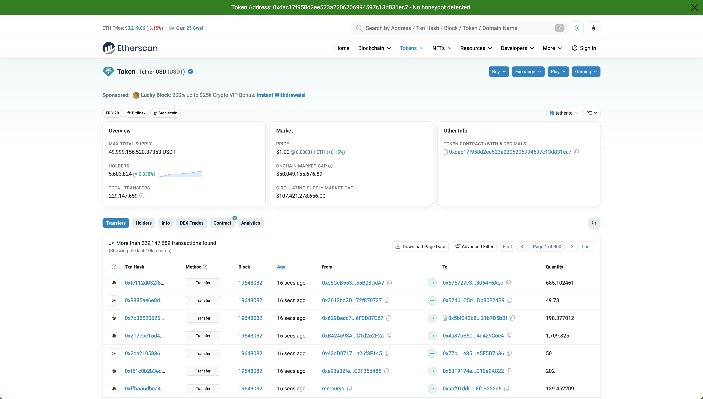

# ERC20 Honeypot Checker Extension

## Overview
The ERC20 Honeypot Checker is a browser extension that helps users identify if an Ethereum token address is a honeypot. This tool is especially useful for cryptocurrency enthusiasts and investors who want to ensure the safety of their transactions on Ethereum.

## Features
- Automatically detects Ethereum addresses in URLs.
- Displays a status bar at the top of the page indicating whether the address is a honeypot.
- Allows users to manually enter an Ethereum address to check.
- Provides a simple and quick way to close the status bar.

## Installation
To install the ERC20 Honeypot Checker:
1. Download the extension from the [Releases](#) page.
2. Open your browser’s extension settings (e.g., `chrome://extensions` for Chrome).
3. Enable Developer Mode (if not already enabled).
4. Click on "Load unpacked" and select the extension directory.

**Note:** Currently, the extension is supported on Chrome and Firefox.

## Usage
Upon visiting a webpage, the extension will:
- Automatically parse the URL for Ethereum addresses.
- Display a red status bar if the address is a honeypot, and green if it is not.
- Users can enter any Ethereum address into the input box in the status bar to perform a check.
- Click the 'Close' button on the right of the status bar to remove it from the page.

## Credits
This extension utilizes the [Honeypot.is API](https://api.honeypot.is) for checking Ethereum addresses. Full credit for the API functionality goes to honeypot.is's founder, who developed and maintains this service. The API is instrumental in providing up-to-date and reliable information on the status of Ethereum addresses.

## License
This project is licensed under the MIT License - see the [LICENSE.md](LICENSE.md) file for details.

## Support
For support, feature requests, or contributions, please open an issue in the [GitHub repository](#) for this project.

## Acknowledgements
- Thanks to honeypot.is's founder for providing the Honeypot.is API.
- Thanks to everyone who has contributed to the development and testing of this extension.
